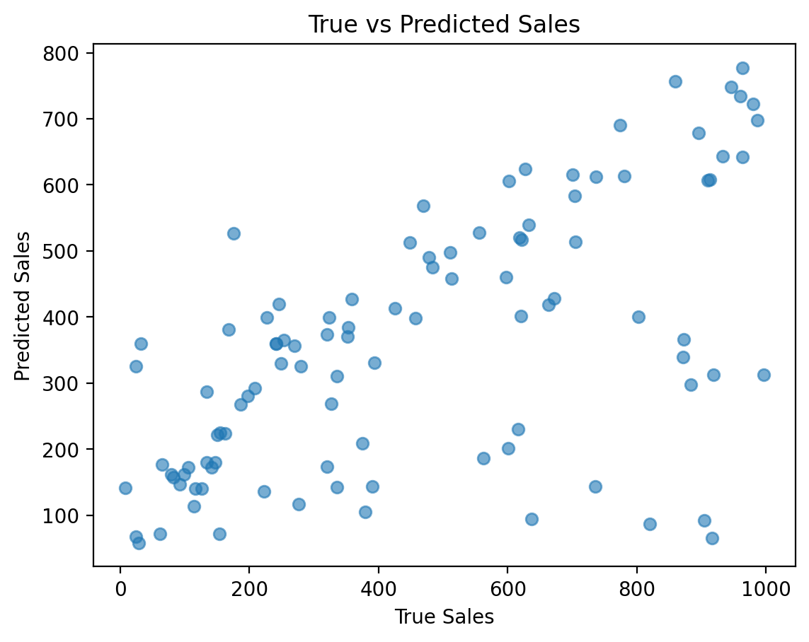

# Supply Chain Management — Demand Forecasting with ML

> Demand forecasting for a makeup supply chain using a neural network.

  

## 🚀 Project Overview

This repository contains a full demand forecasting solution for a fashion & beauty startup’s makeup supply chain. By predicting **“Number of products sold”**, the model helps optimize inventory, reduce stockouts, and enhance supply-chain efficiency.

### Key Steps

1. **Data Preparation & EDA**
2. **Neural-Network Model** (128 → 64 → 32 layers)
3. **Training & Validation**
4. **Evaluation** (MSE + scatter plot)
5. **Model Export & Inference**
6. **Interactive Streamlit App**

## 📁 Repository Structure

```
.
├── data/
│   └── supply_chain_data.csv                           # Raw dataset
├── notebooks/
│   └── supply_chain_demand_forecasting.ipynb           # Colab-ready notebook
├── models/
│   ├── demand_forecasting_model.keras                  # Trained Keras model
│   ├── scaler.pkl                                      # StandardScaler used in training
│   └── feature_columns.pkl                             # Feature column order used for prediction
├── streamlit_app/
│   └── app.py                                          # Streamlit dashboard app
├── assets/
│   └── true_vs_predicted.png                           # Sample visualization
└── README.md                                           # Project overview
|__ requirements.txt                                    # All necessary libraries to download.
```

## 🛠️ Setup & Usage

### 1. Install dependencies:

```bash
pip install pandas numpy matplotlib scikit-learn tensorflow streamlit joblib
```

### 2. Run the notebook:

Open `notebooks/demand_forecasting.ipynb` in Google Colab or Jupyter:

- Upload your dataset (CSV)
- Clean & preprocess the data
- Train the neural network model
- Evaluate results with MSE & plot
- Save the model, scaler, and feature columns to disk

### 3. Launch the Streamlit app:

From your project root:

```bash
streamlit run streamlit_app/app.py
```

Upload your CSV to get instant sales predictions and visual feedback!

## 📊 Streamlit Dashboard Preview



Features:
- Live file upload
- Automatic preprocessing (date + categorical)
- Prediction of "Number of products sold"
- MSE & R² score display
- Scatter plot of true vs predicted
- Option to download prediction CSV 

## 🔄 Next Steps

* 🔧 Perform hyperparameter tuning (e.g., with KerasTuner)
* 📈 Try advanced models like LSTM or XGBoost
* ✨ Enhance Streamlit with interactive filters, export buttons, etc.

---

> Built with ❤️ by Anas


